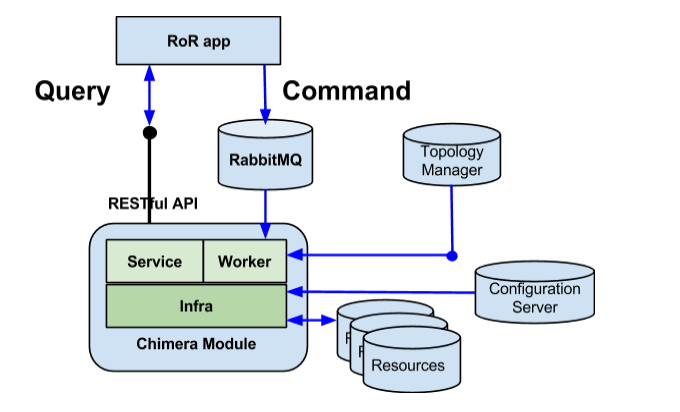

## Fiverr

Fiverr is a global online marketplace offering tasks and services, beginning at a cost of $5 per job performed, from which it gets its name. The site is primarily used by freelancers who use Fiverr to offer a variety of different services to
customers worldwide

**Founded**: 2010

### References

- [Scaling the biggest marketplace for services: From a Ruby on Rails Monolith to Microservices and CQRS](http://blog.fiverr.com/scaling-biggest-marketplace-services-ruby-rails-monolith-microservices-cqrs/)

### Case Study

To start things off, we used a classic Ruby on Rails application on a LAMP stack because of its simplicity and ease of bootstrapping.

Here’s the approach we took to ensure system scalability and long-term quality:

**First**, we mapped all problems to four major groups:

- Application performance
- System quality
- System scalability
- Delivery velocity

**Next**, we defined our targets:

- Single feature failure should not cause whole system failure.
- Single feature slowness should not cause whole system slowness.
- Business flows should have clear implementation and deployment boundaries. For - example the flow responsible for communication between users should not be - mixed with the flow responsible for payments.
- The system should be scalable at the lowest possible level.
- Polyglot programming should be supported.

Two paradigms became the basis for the architecture change:

- [Microservices](http://martinfowler.com/articles/microservices.html) – We decided that microservices would be responsible for query operations when the higher application layer interacts with microservices using RESTful protocol.

- [CQRS (Command and Query Responsibility Segregation)](http://martinfowler.com/bliki/CQRS.html) – We moved command operations (INSERT, UPDATE, DELETE) to an event-based asynchronous platform using RabbitMQ as a message broker.

**Pros:**

- Each Chimera module can be implemented and tested separately.
- Each Chimera module can be deployed, monitored and scaled separately.
- Business domain modules can be isolated at run time, providing greater system resilience.
- The learning curve for new developers can be divided into stages, taking business domain modules one by one.
- Different modules can be implemented in different languages. For example, we use node.js for high-throughput services.

**Cons:**

- More moving parts results in higher complexity.
- Some code duplication is inevitable.
